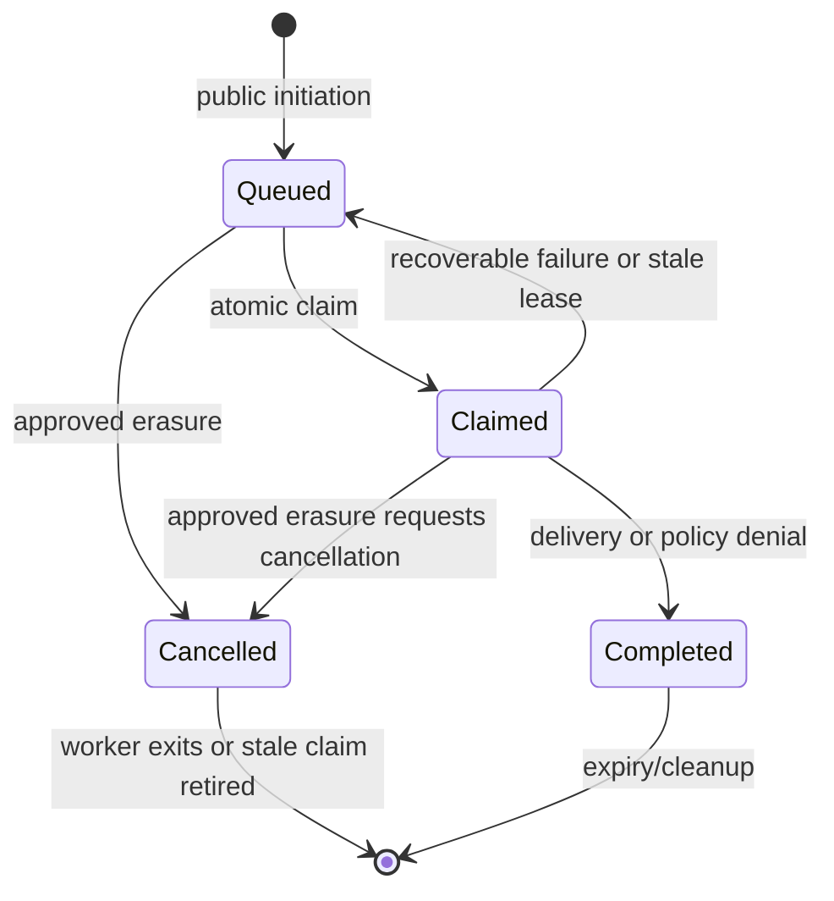
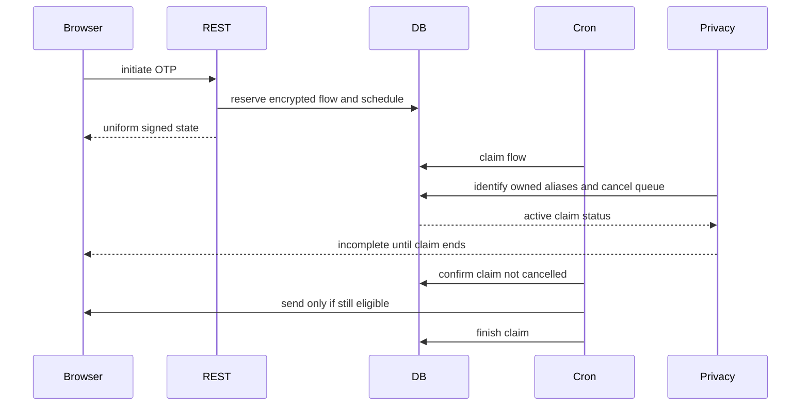
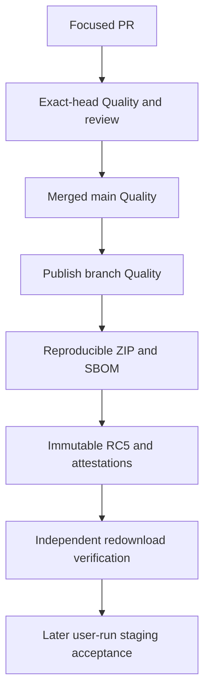

# RC5 authentication, privacy, browser, and release hardening

## Goal Capsule

Fix the five validated RC4 findings, the confirmed queued-worker crash risk, and the confirmed checkout-modal focus failure. Prove the fixes with regression tests and repository gates, then publish `v1.3.0-rc5` through a protected PR and immutable GitHub release. No live-site change or protection bypass is authorized. If any required gate blocks, stop and report it.

---

## Product Contract

### Summary

Pinova issues purpose-bound OTP state before a deferred WordPress Cron worker resolves the account and sends a code. The queued state, privacy erasure, and retry path must remain safe across races and process failure. Browser focus must return to the live checkout opener after closing the modal. The release SBOM must exactly account for bundled production Composer packages.

### Requirements

**Authentication and privacy**

- R1. A verified login or recovery OTP must not make the next initiation reuse spent state; the next allowed attempt obtains a fresh flow, with existing rate limits retained.
- R2. A worker crash after claiming a queued delivery must not strand it for the full OTP lifetime. A bounded retry must avoid concurrent duplicate sends and preserve the rule that account lookup and provider calls occur only after the public response.
- R3. Approved erasure must cover uniquely owned mobile aliases used by runtime resolution, including legacy Digits and configured keys, without deleting ambiguous or another user's data. Lookup failure must make erasure incomplete.
- R4. Erasure and claimed work must coordinate: no erasure may report completion while its worker could still create or send an OTP. A worker cancelled before provider send must not send. Failed or interrupted erasure remains retryable.
- R5. Public responses, logs, JWT state, and OTP purpose boundaries remain non-enumerating and secret-free.

**Integration and release correctness**

- R6. A disposable integration test must execute the scheduled OTP event through WordPress Cron in a separate request and verify exactly one delivery; direct `do_action` tests remain useful but cannot substitute for this test.
- R7. The checkout modal must return focus to the current live opener even after WooCommerce replaces its fragment during a pending request. The browser assertion and test-sensitivity guard remain intact.
- R8. The SBOM gate must reject missing, duplicate, extra, malformed, or inconsistently identified Composer entries, while allowing non-Composer entries appropriate to SPDX output.
- R9. PR exact-head, merged-main, publish-branch, package, attestation, and immutability checks must pass before RC5 is considered published. Staging and production adoption remain separate, user-owned activities.

### Scope Boundaries

Do not change public route signatures, core WordPress tables, live installations, repository protections, or existing immutable releases. Do not weaken browser assertions, remove authentication rate limits, or add broad sensitive logging. No unrelated optimization is planned; confirmed adjacent defects on these paths may be fixed with a regression test.

---

## Planning Contract

### Key Technical Decisions

- KTD1. Keep the existing rate-limit table and encrypted queue. Make a claim recoverable through a bounded lease while preserving the authenticated ciphertext; use atomic state transitions to keep one active worker per flow. Do not introduce a second queue or generic job framework.
- KTD2. Treat an active claim as an erasure barrier. Mark it cancelled and return `done: false` until the worker exits or a demonstrably stale claim is safely retired. A worker checks cancellation before creating or sending. Keep all operations idempotent.
- KTD3. Derive erasure aliases from the same mobile resolution rules as authentication and verify unique ownership before touching alias-keyed queue rows. Database uncertainty fails closed.
- KTD4. Keep the RC tag as the package version marker while plugin semantic version remains `1.3.0`; `Version::update_130()` already covers the version. Update release history and package metadata only where the repository's release rules require it.

### High-Level Technical Design

The queued OTP lifecycle is a state machine, not a simple cron callback:

The privacy and delivery ordering crosses requests:

The release path has separate trust gates:

### Assumptions

The existing provider calls have bounded timeouts shorter than the recovery lease; this must be verified before finalizing the lease. If no finite bound exists, add one. An interrupted provider call may have an unknown external outcome, so recovery must favor one active attempt, safely retire ambiguous state, and allow a new flow rather than blindly resending the same OTP.

---

## Implementation Units

### U1. Reproduce and pin queue and erasure failures

- **Goal:** Add deterministic integration coverage for spent login/recovery flows, stale claims, active-worker erasure, uniquely owned legacy aliases, ambiguous aliases, and database errors.
- **Files:** `tests/Integration/SecurityRegressionTest.php`, `tests/Integration/PrivacyIntegrationTest.php`, and focused helper fixtures if needed.
- **Approach:** Exercise real API/service entrypoints and database state. Use hooks/interleaving controls where necessary; do not add elapsed-time sleeps or production-only test switches.
- **Test scenarios:** A verified login/recovery OTP followed by initiation produces a new flow; a crash-simulated claimed job becomes retryable after its lease; an active worker prevents `done: true`; a cancelled worker sends nothing; Digits/configured aliases are erased only for one uniquely resolved owner; ambiguous or failed lookup leaves the request incomplete without erasing another account.

### U2. Implement bounded queue recovery and privacy coordination

- **Goal:** Make the existing encrypted queue recoverable, cancellable, and idempotent without leaking account existence.
- **Files:** `src/Services/RateLimitService.php`, `src/Services/OTPService.php`, `src/Services/UserService.php`, `src/Integrations/Wordpress/Privacy.php`, and tests from U1.
- **Approach:** Atomically claim/finish work, retain authenticated ciphertext until safe completion, use a bounded lease and cancellation marker, and retire verified reservations. Recheck worker eligibility before send. Preserve signed state and rate-limit behavior.
- **Test scenarios:** Only one concurrent claimant proceeds; stale work recovers; provider failure can retry; successful or denied work does not resend; erasure before and after claim is safe; interrupted erasure can complete on retry; no OTP/password/token reaches logs.
- **Execution note:** Verify the race tests before considering happy-path tests sufficient.

### U3. Test the real Cron boundary

- **Goal:** Demonstrate REST initiation → shutdown scheduling → separate WordPress Cron delivery against disposable services.
- **Files:** `tests/Integration/` and `.github/workflows/quality.yml` only if a new invocation is needed.
- **Approach:** Use an isolated wp-env test site and a safe mail/provider interceptor. Trigger a fresh request and the actual cron runner, not the hook directly.
- **Test scenarios:** Public response precedes provider send; one queued event produces one eligible OTP; repeated runner invocation does not resend; unavailable runner yields an explicit failed check.

### U4. Repair checkout focus and preserve browser sensitivity

- **Goal:** Restore focus to a live, focusable opener after reactive hide and replacement.
- **Files:** `assets/js/pages/login-modal.js`, `tests/js/modal-focus-lifecycle.test.mjs`, `tests/browser/account-ui.spec.mjs` if strengthening is needed.
- **Approach:** Use DOM/reactive completion rather than an arbitrary delay, and keep stale callback guards for rapid reopen.
- **Test scenarios:** Close during pending request after opener replacement focuses the live replacement; ordinary close, rapid reopen, and step changes do not steal focus; full Chromium browser test and mutation sensitivity pass.

### U5. Close the SBOM inventory bypass

- **Goal:** Require exact Composer package identity, count, and purl correspondence in the release SBOM.
- **Files:** `tools/check-sbom-content.sh`, `tests/check-sbom-content.sh`.
- **Approach:** Validate all Composer-marked entries before comparing normalized name/version inventory. Keep legitimate non-Composer entries outside the comparison.
- **Test scenarios:** Missing or malformed Composer purl, mismatched name/version, duplicates, and extra packages fail; exact inventory passes.

### U6. Gate, merge, and publish RC5

- **Goal:** Complete protected review and immutable publication only after all applicable checks are green.
- **Files:** `CHANGELOG.md`, `readme.txt`, release evidence under `.agents/reviews/` as required, and GitHub PR/release metadata.
- **Approach:** Run lightweight local checks; push one focused PR; wait for exact-head CI and CODEOWNER approval; merge without bypass; verify merged-main and publish branch; release through the existing workflow; independently verify ZIP, checksum, SBOM, attestations, and immutable API flag.
- **Test scenarios:** PR checks all pass at the final head; required review is present and conversations resolved; release ZIP is redownloadable and matches its checksum; tag is immutable and existing RC releases are untouched. If any gate fails, stop and report the exact condition.

---

## Verification Contract

| Gate | Evidence | Applies to |
| --- | --- | --- |
| PHP syntax and focused shell/JS checks | `php -l` on changed PHP, `bash tests/check-sbom-content.sh`, `npm run test:js`, governance and changelog checks | U1–U6 |
| Integration and Cron | Disposable GitHub Actions WordPress integration jobs, including actual separate-request cron test | U1–U3 |
| Browser | Chromium checkout test, full browser suite, modal sensitivity runner | U4 |
| Quality and package | Required Quality jobs, Composer/npm audits, Plugin Check, ZIP/SBOM reproducibility | U5–U6 |
| GitHub protection and release | Exact-head PR review/checks, merged-main and publish-branch Quality, immutable Release API, independent asset verification | U6 |

---

## Definition of Done

All validated findings and confirmed defects have regression coverage; no known P1/P2 issue on the touched paths remains; required CI and protected review pass; RC5 is an immutable GitHub prerelease with verified artifacts. The live site is unchanged. A blocked protection or test gate is reported with the exact failed requirement, without bypass or publication.
