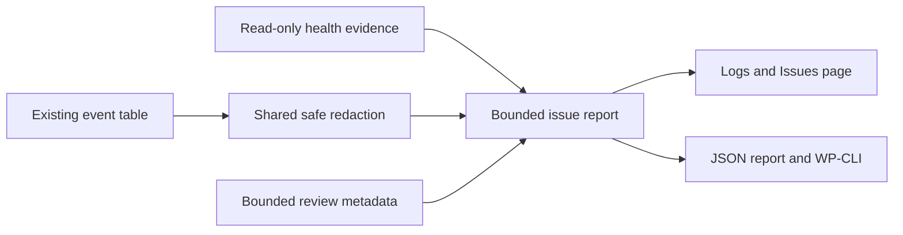
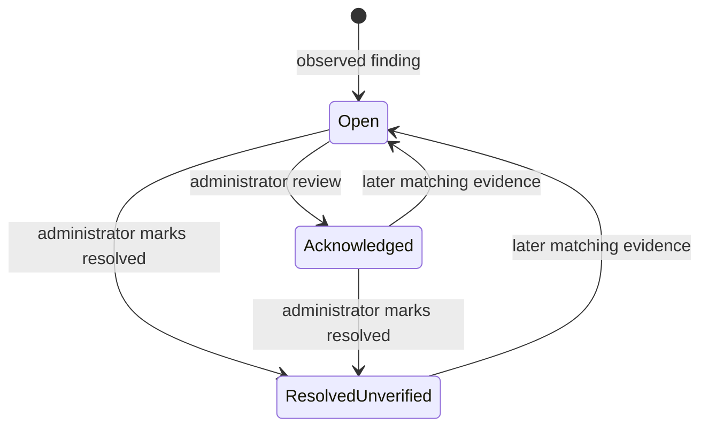

# Pinova Logs and Issues - Plan

## Goal Capsule

**Objective:** Administrators and AI can identify observed Pinova failures, expected authentication rejections, and gaps in evidence from one reliable monitoring report.

**Means:** Extend the existing Logs page, privacy-safe event records and JSON export; fix verified logging and compatibility defects; publish a reviewed release candidate and validate it on the authorized test site.

**Authority:** The user's scope and deployment instructions govern this plan. Production remains read-only; the user installs the release there. Stop installation for failed release integrity, unsafe rollback, data-preservation failure or failed staging acceptance.

---
## Product Contract

### Summary

Rename the existing page to Logs and Issues. Add grouped findings, understandable explanations, evidence, coverage limitations and review status. Preserve ordinary event filtering and provide the same report through JSON and a read-only WP-CLI command.

### Problem Frame

An empty warning/error list does not establish operational health. Current cleanup and read failures can resemble successful empty results. Some channel failures and queue outcomes are absent; the existing viewer/export drops safe reasons and timing already stored in events. A residual TeraWallet/WooCommerce HPOS report error needs a narrowly reproduced compatibility fix.

### Key Decisions

- **Monitoring is the requested capability.** Governs R1, R7. (session-settled: user-directed — chosen over autonomous code repair and deployment: the user wants accurate on-demand diagnosis and visible issues.)
- **Release first, then test-site installation only.** Governs R8. (session-settled: user-directed — chosen over agent installation on production: the user will install the verified release on the live site.)

### Requirements

#### Evidence and issue tracking

- R1. Classify findings as confirmed operational failures, expected rejections, or insufficient evidence; an operational failure alone never establishes a code bug or its root cause.
- R2. Group related observations with stable identifiers, observed counts, first/last timestamps, safe reason, component, build identity and bounded evidence links.
- R3. Show selected range, observed-event limits, retention, effective logging threshold, sampling, incomplete queries, missing outcomes and uninspected external log sources; never infer healthy operation or a verified fix from silence.
- R4. Let an administrator acknowledge or mark an observed issue resolved without deleting evidence; later matching observations reopen it, while manual resolution is explicitly unverified.
- R5. Give the administrator page, downloadable report and read-only CLI the same classifications and safe evidence, with authorization and historical-data redaction preserved.

#### Reliability and preservation

- R6. Expose cleanup/read/write degradation truthfully, record false-return channel failures and bounded terminal queue outcomes, and fix the reproduced HPOS report defect without changing authentication or order semantics.
- R7. Keep implementation inside Pinova, preserve all existing users/orders/settings and authentication invariants, and make monitoring failures nonfatal. Do not add an autonomous repair service or inspect other sites automatically.
- R8. Require reviewed history, passing CI, immutable release artifacts and independently verified downloads before installation on the authorized test site; notify the user only after the installed package passes scoped acceptance.

### Acceptance Examples

- AE1. Covers R1, R3: token expiry appears as an expected rejection; a failed channel appears as an observed operational failure with root cause unconfirmed.
- AE2. Covers R2–R4: a repeated failure increments its observed group; acknowledging does not hide it; a new failure after manual resolution reopens the group.
- AE3. Covers R3, R6: database read/cleanup failure produces unavailable/degraded evidence, not zero-errors success; an unmatched queue event remains inconclusive.
- AE4. Covers R5, R7: historical credential-like context never reaches the page or JSON, while approved reason codes and timing appear identically.

### Scope Boundaries

External Wordfence configuration warnings remain a reported external issue unless evidence establishes a necessary safe Pinova fix. The separately corrected server cron lock requires no repeat change. No theme, third-party plugin or shared-service changes, real message sends, AI provider connection, automatic code changes or production installation are included.

---
## Planning Contract

### Key Technical Decisions

- KTD1. Compute a bounded report from retained events on demand, reusing the existing table and keyset reads. Limit reports to seven UTC calendar days and 1,000 inspected events, expose truncation, and keep issue review metadata bounded by finite catalog keys. Bound diagnostic context input size and output bytes; freeze a high-water event ID. No new event database or background monitor is needed for R1–R5.
- KTD2. Use a shared finite, event-specific redaction/classification catalog. Unknown reasons remain inconclusive; code-shaped strings are not sufficient evidence of safe historical content. Public responses remain unchanged for R5–R7.
- KTD3. Store review state separately from event data with a reviewed-through event ID. Rendering never mutates state. Resolution means administrator-reported, not verified; recurrence beyond the reviewed ID reopens. Reject stale review submissions and disable global resolution for filtered, failed or truncated evidence. Range expiry is labeled as outside retained evidence, never resolution, for R4.
- KTD4. Record logging health in bounded non-autoloaded state with fixed codes and timestamps. Database failures use the existing fallback path without claiming durable acceptance from a void WooCommerce logger call. Never add write probes on report reads, per R3, R6, R7.
- KTD5. Add only safe sampled queue outcomes and per-channel elapsed time. Preserve claim, cancellation, expiry and unknown-provider-outcome guards; accepted delivery is distinct from physical receipt, per R1, R6, R7.
- KTD6. The installed TeraWallet callback appends a numeric posts.ID exclusion to HPOS reports. Reproduce it through the real upstream callback and add a narrowly version-bounded Pinova adapter. Protect literals, legacy storage queries and order exclusion semantics, per R6, R7.

### High-Level Technical Design

### Assumptions and Risks

The report is a bounded view of retained observations, not a complete incident database. Persisted review metadata must not imply evidence exists after its retention window. Changes in log level, sampling, exports, missing schema or reads can reduce coverage. A successful read does not prove future writes, and provider acceptance does not prove receipt. Heavy tests and packaging run on GitHub Actions because this development host also serves live tenants.

---
## Implementation Units

### U1. Preserve diagnostic evidence and truthful logging health

**Goal:** Remove verified logging blind spots.

**Requirements:** R3, R5–R7; AE3, AE4.

**Dependencies:** None.

**Files:** `src/Logging/`, `src/Admin/Logs.php`, `src/Services/ChannelService.php`, `src/Services/OTPService.php`, `src/Pinova.php`, `tests/Unit/LoggingTest.php`, `tests/Integration/LoggingIntegrationTest.php`, focused new logging tests.

**Approach:** Follow KTD2, KTD4 and KTD5. Separate read success from empty results, preserve failed cleanup outcomes and missing-schema detection, retain approved diagnostic fields, and add safe bounded worker outcomes. Reuse current logger and throttle contracts.

**Execution note:** Add failure-injection and privacy regressions before changing their owning behavior.

**Test scenarios:**
- False-return channel failure is recorded even when another channel succeeds.
- Cleanup query failure differs from a successful zero-row deletion.
- Missing/read-failing tables or flow columns report unavailable/degraded.
- A filtered or failed WooCommerce fallback cannot be claimed as durable logging success.
- Queue policy suppression, expiry, cancellation and uncertain acceptance keep existing auth behavior and produce only approved evidence.
- Malformed historical strings are removed while approved reasons/timing survive.

**Verification:** Targeted regressions and existing authentication/logging tests pass without exposing identifiers or altering public responses.

### U2. Present and export actionable issue reports

**Goal:** Supply one report to administrators and AI.

**Requirements:** R1–R5, R7; AE1–AE4.

**Dependencies:** U1 shared contracts.

**Files:** `src/Logging/IssueMonitor.php`, `src/Admin/Logs.php`, `src/Admin/Menu.php`, `src/Pinova.php`, `tests/Unit/IssueMonitorTest.php`, `tests/Integration/LoggingIntegrationTest.php`, relevant browser fixtures.

**Approach:** Follow KTD1–KTD3. Add finite classifications and bounded grouping, attach evidence and coverage, rename the existing page, add nonce-protected review actions, and expose a read-only JSON CLI report. Keep current raw-event filters and clear action separate from issue review.

**Test scenarios:**
- Expected rejection and confirmed operational failure remain distinct, with unknown evidence inconclusive.
- Repeated events group without identifiers in keys; first/last and observed counts are correct.
- Reviewed rows remain visible and recurrence reopens; a concurrent newer observation cannot be hidden by a stale review action.
- Unauthorized or invalid-nonce review/export fails; read-only report does not change options or logs.
- Truncation, empty tables, filtered levels, expiry and unavailable external streams prevent an all-clear conclusion.
- Browser page and JSON/CLI share the same classifications and preserve safe evidence.

**Verification:** Unit, WordPress integration and browser evidence cover the report and lifecycle; bounded query and storage limits hold.

### U3. Fix the residual wallet HPOS report query

**Goal:** Prevent the observed legacy posts alias from breaking HPOS reports.

**Requirements:** R6, R7.

**Dependencies:** None.

**Files:** `src/Integrations/Woocommerce/`, focused wallet HPOS compatibility tests and real-plugin fixture tooling where required.

**Approach:** Follow KTD6. Characterize the actual callback and identify the smallest supported query shape; leave unsupported shapes untouched.

**Execution note:** Require an unadapted failing reproduction and adapted native-report equivalence before accepting the fix.

**Test scenarios:**
- Real supported TeraWallet/WooCommerce HPOS report callback reproduces the original alias error without the adapter.
- Adapted HPOS and legacy-storage reports retain intended parent/child order exclusions.
- SQL string literals and unrelated plugins' query shapes remain unchanged.

**Verification:** Supported third-party CI profiles pass with HPOS on/off and owned synthetic orders cleaned up.

### U4. Review, release and validate the installed package

**Goal:** Deliver a verified test-site installation the user can assess before production.

**Requirements:** R7, R8.

**Dependencies:** U1–U3.

**Files:** `README.md`, `readme.txt`, `CHANGELOG.md`, `.agents/skills/pinova-development/references/logging.md`, `.agents/reviews/`, release metadata only if required by the selected unused candidate.

**Approach:** Document final behavior and limitations. Complete simplification and independent code review, exact-head and merged-main CI, controlled immutable candidate publication, independent download/attestation verification, authorized private test-site rollback backup, installation and scoped acceptance.

**Test scenarios:**
- Package retains runtime dependencies and excludes development/private material.
- Upgrade and rollback preserve installed data/settings; candidate migration is idempotent.
- Test-site admin page, safe JSON/CLI, logging health, real-plugin HPOS and authentication smoke succeed without sending real messages.
- Main-site package identity is unchanged and shared services remain unaffected.

**Verification:** Record exact release/build/install evidence and report any external or unverified boundary honestly.

---
## Verification Contract

Run bounded changed-file PHP lint, focused existing-dependency tests when available, and the repository governance/changelog/skill-sync gates locally. Full PHPUnit, static analysis, coding standards, browser acceptance, HPOS compatibility matrix, dependency checks and reproducible package build belong on GitHub Actions. Required checks are never bypassed. Release and staging gates follow `.agents/skills/pinova-development/references/quality-and-release.md`.

---
## Definition of Done

R1–R8 have tested implementation evidence; every review finding is fixed or justified with a documented boundary. Abandoned implementations and synthetic fixtures are removed without deleting pre-existing data. The new immutable GitHub candidate is independently verified, installed only on the test site, and passes scoped acceptance. The user receives release links, verification results, limitations and confirmation that production installation remains theirs.
